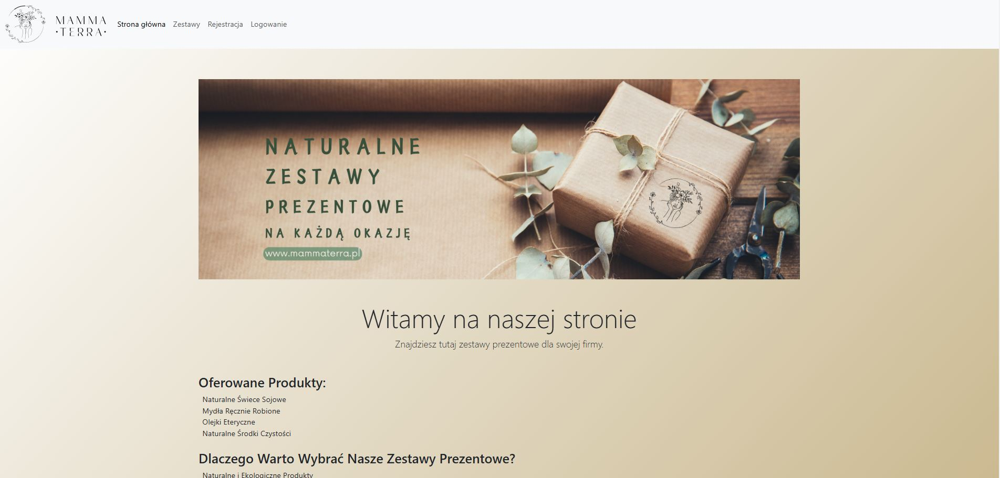

# Web Product Catalogue

**Web application for product catalogue management built in Node.js and MongoDB**



## About this Application

This is a web application developed using Express.js, MongoDB and EJS. The main features are:
- Product catalogue with filtering and search capabilities
- User login and registration with session support
- CSV file generation with product list
- Support for user accounts with roles (user/administrator)
- API for product and user management
- EJS views with dynamic layouts

 
## Table of contents
- [Requirements](#requirements)
- [Installation](#installation)
- [Configuration](#configuration)
- [Launching the application](#starting-application)
- [Functionality](#functionality)
- [API Endpoints](#api-endpoints)
- [Web routes](#web-routes)
- [Directory structure](#directory-structure)
- [Description of data models](#description-data-models)
- [Author](#author)
- [Licence](#licence)

## Requirements

- **Node.js** (version 14 or higher)
- **MongoDB** (locally or on MongoDB Atlas)
- Installed Node.js packages (versions used in the project):
  - `express` ^4.19.2
  - `mongoose` ^8.3.2
  - `bcrypt` ^5.1.1
  - `dotenv` ^16.4.5
  - `multer` ^1.4.5-lts.1
  - `ejs` ^3.1.10
  - `express-session` ^1.18.0
  - `cookie-parser` ^1.4.6
  - `bootstrap` ^5.3.3
  - `json2csv` ^6.0.0-alpha.2

## Installation

1. **Clone the repository:**
```bash
git clone https://github.com/yourusername/web-product-catalogue.git
cd web-product-catalogue
```

2. **Install dependencies:**
```bash
npm install
```
