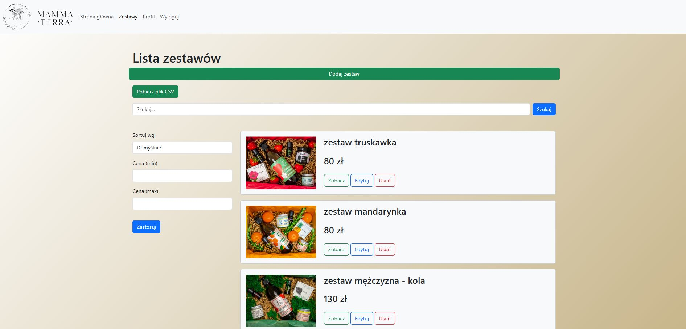
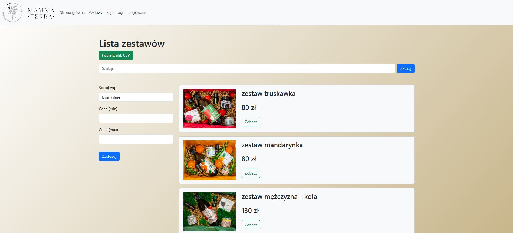
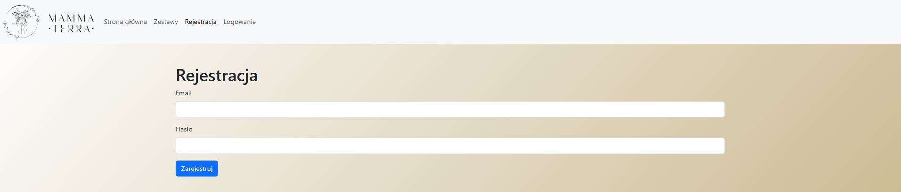

# Web Product Catalogue

**Web application for product catalogue management built in Node.js and MongoDB**


## About this Application 📝

This is a web application developed using Express.js, MongoDB and EJS. The main features are:
- Product catalogue with filtering and search capabilities
- User login and registration with session support
- CSV file generation with product list
- Support for user accounts with roles (user/administrator)
- API for product and user management
- EJS views with dynamic layouts

 
## Table of contents
- [Requirements](#requirements)
- [Installation](#installation)
- [Configuration](#configuration)
- [Launching the application](#starting-application)
- [Features](#features)
- [Screenshots](#screenshots)
- [API Endpoints](#api-endpoints)
- [Data models](#description-data-models)
- [Author](#author)
- [Licence](#licence)

## Requirements

- **Node.js** (version 14 or higher)
- **MongoDB** (locally or on MongoDB Atlas)
- Installed Node.js packages (versions used in the project):
  - ✅ `express` ^4.19.2
  - ✅ `mongoose` ^8.3.2
  - ✅ `bcrypt` ^5.1.1
  - ✅ `dotenv` ^16.4.5
  - ✅ `multer` ^1.4.5-lts.1
  - ✅ `ejs` ^3.1.10
  - ✅ `express-session` ^1.18.0
  - ✅ `cookie-parser` ^1.4.6
  - ✅ `bootstrap` ^5.3.3
  - ✅ `json2csv` ^6.0.0-alpha.2
- 
## Installation

1. **Clone the repository:**
```bash
git clone https://github.com/yourusername/web-product-catalogue.git
cd web-product-catalogue
```

2. **Install dependencies:**
```bash
npm install
```

## Configuration

Create an .env file and configure it:

```js
PORT=9999
DATABASE=your_mongodb_uri
SESSION_KEY_SECRET=your_session_secret_key
```

## Launching the application

starting the application in development mode
🚀🚀🚀🚀🚀🚀
```bash
npm run watch
```

## Features

- <strong>Gift set management</strong> - viewing, adding, editing and deleting products
- <strong>User registration and log-in</strong> - registration and log-in forms, user authorisation
- <strong>Administration panel</strong> - managing product catalogue contents
- <strong>Exporting data to CSV</strong> - downloading CSV files with the list of products
- <strong>Searching and filtering</strong> - possibility of searching for products and filtering by price
- <strong>Middleware</strong> - ensuring secure access to the administration panel and user sessions

## Screenshots


##### Admin Panel


##### User Panel


##### Registration form

## API Endpoints

#### GiftSetController

- ```GET /sets``` - displays a list of gift sets
- ```GET /sets/:name``` - displays details of a single set
- ```POST /admin/sets/add``` - adds a new set (multer file handling)
- ```POST /admin/sets/:name/edit``` - edits an existing set (file handling)
- ```GET /admin/sets/:name/delete``` - removes a set from the database
- ```GET /admin/sets/:name/delete-image``` - deletes an image assigned to a set
- ```GET /csv``` - generates and downloads a CSV file with the product data

####  UserController

- ```GET /registration``` - registration form
- ```POST /registration``` - new user registration
- ```GET /login``` - login form
- ```POST /login``` - user login
- ```GET /logout``` - user logout
- ```GET /profile``` - displays the profile editing form
- ```POST /profile``` - update user profile data

#### PageController

- ```GET /``` - application home page
- ```GET /*``` - 404 error handling

## Data models

#### GiftSet model
Stores data on sets, including:

- ```name``` (String, required)
- ```slug``` (String, required, unique)
- ```price``` (Number, required)
- ```image``` (String)

#### User model
Stores user data:

- ```email``` (String, required, unique)
- ```password``` (String, required, hashed before saving)
- ```isAdmin``` (Boolean, false by default)
- ```firstName```, ```lastName``` (String, optional)

## Author 

This project was created by Krzysztof Rudnicki 😄

## License

This project is licensed under MIT rules.


